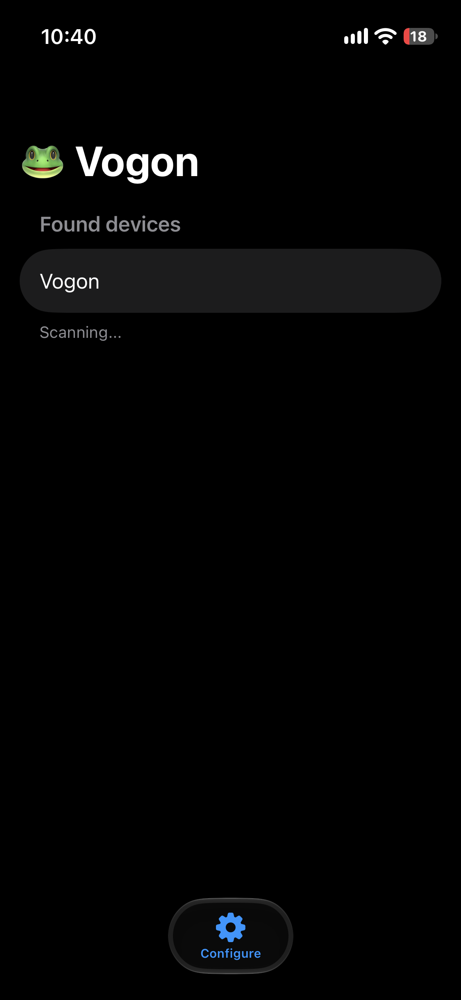
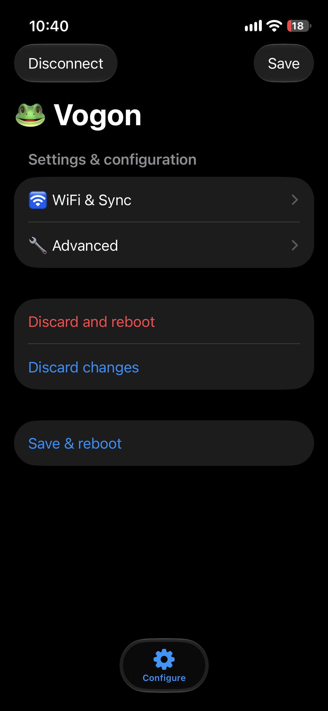
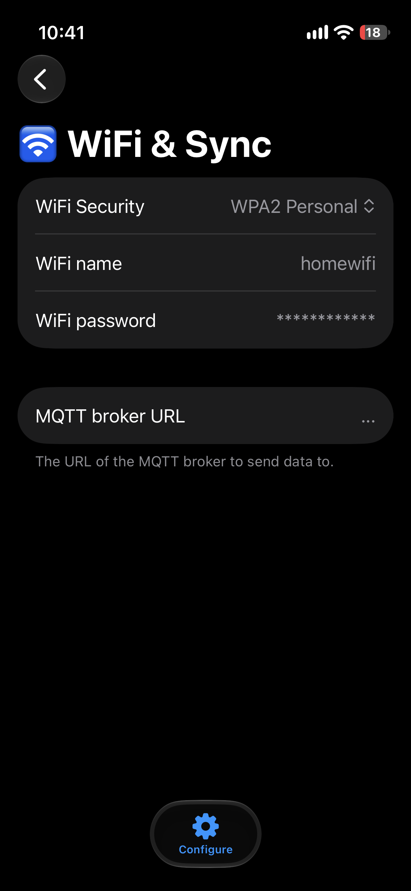
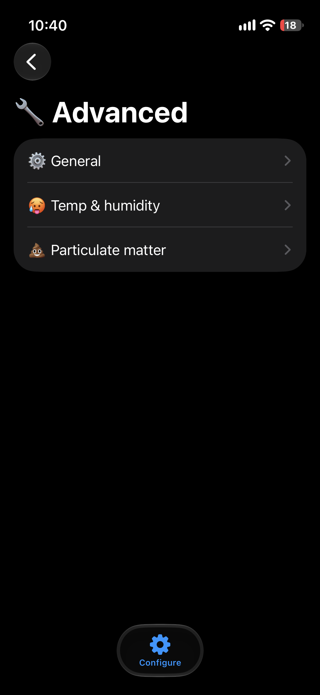
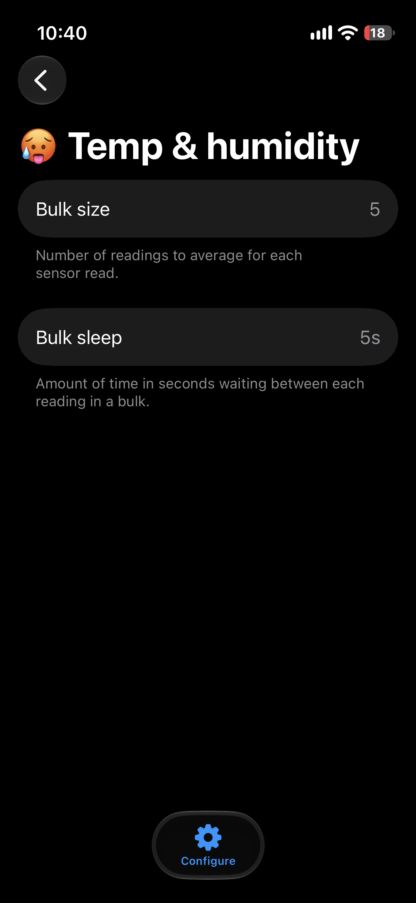

# Vogon iOS

SwiftUI iOS app for discovering, connecting to, and configuring Vogon environmental sensor devices over Bluetooth Low Energy (BLE).

## Features

- Automatic scanning for Vogon devices
- Connect / disconnect management with status feedback
- Reads characteristics from a dedicated configuration GATT Service
- Inline editing with type‐aware parsing
- Safe writes (only sends value if changed)

## GATT interface

Configuration Service UUID: `d0a823a6-fa98-4597-b0c1-d8577be0e158`

Characteristic groups

| Group                         | Field           | UUID   | Type   |
| ----------------------------- | --------------- | ------ | ------ |
| General                       | Read interval   | 0x0101 | UInt16 |
| Temperature & humidity sensor | Bulk size       | 0x0201 | UInt16 |
|                               | Bulk sleep      | 0x0202 | UInt16 |
| Particulate matter sensor     | Warm up time    | 0x0203 | UInt16 |
|                               | Bulk size       | 0x0204 | UInt16 |
|                               | Bulk sleep      | 0x0205 | UInt16 |
| Synchronization               | WiFi name       | 0x0701 | String |
|                               | WiFi password   | 0x0702 | String |
|                               | MQTT broker URL | 0x0703 | String |

## Build & run

1. Open `vogon.xcodeproj` in Xcode 16 (or current).
2. Ensure Bluetooth permission strings exist in `Info.plist`.
3. Select an iOS device (physical recommended for BLE) and run.

## Screenshots

|                                                                                                                                                                         |                                                                                                                                                       |
| :---------------------------------------------------------------------------------------------------------------------------------------------------------------------: | :---------------------------------------------------------------------------------------------------------------------------------------------------: |
|                        **Scanning:** Find nearby Vogon devices.                        |    **Device controls:** Open settings, save changes, or reboot.   |
|        **Wi-Fi & Sync:** Set Wi-Fi credentials and the MQTT broker.       |  **Advanced:** Choose a sensor settings group. |
|  **Temperature & humidity:** Tune batch size and timing. |                                                                                                                                                       |
